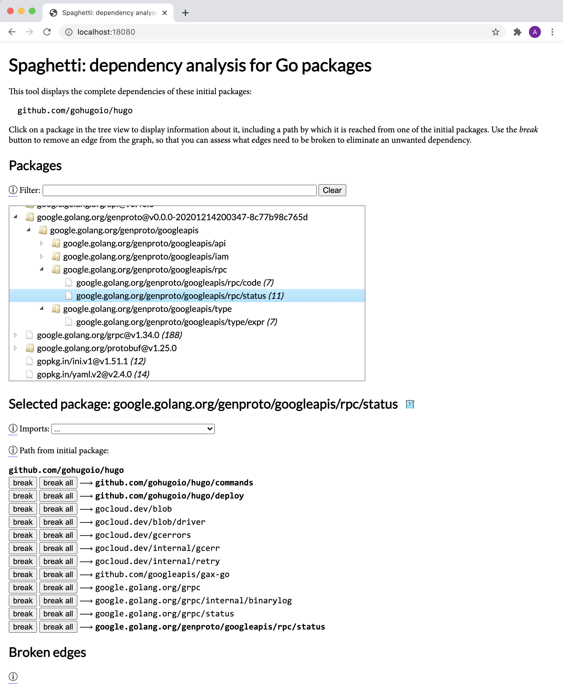

# Spaghetti: a dependency analysis tool for Go packages

Spaghetti is an interactive web-based tool to help you understand the
dependencies of a Go program, and to explore and evaluate various
possible efforts to eliminate dependencies.

It displays the complete dependencies of the initial packages,
organized into a tree based on the directory structure of the
package/module namespace.

Clicking on a package node displays information about it,
including an arbitrary path to it from one of the initial packages.
Each edge in the path may be "broken", causing it to be removed
from the graph and the view recomputed.
The broken edges are tabulated, and each can be restored if you change
your mind or try another approach.
In this manner, you can explore how your overall dependencies would
change as you work to remove specific imports.
Once you are happy with the overall dependencies, the set of broken
edges becomes your task list for a clean-up project.

Run it like so:

```shell
$ go install github.com/adonovan/spaghetti@latest   # install in $HOME/go/bin
$ ~/go/bin/spaghetti [package] &                    # run the server
$ open http://localhost:8080                        # open in chrome, firefox, etc
```

where _package_ is or more Go packages, or a pattern understood by `go
list`. Then point your browser at the insecure single-user web server
at `localhost:18080`.

This tool is a rewrite from scratch of a tool I wrote while at Google
for exploring the dependency graphs used by the Blaze build system.
The basic design could be easily be generalized to support any kind of
dependency graph, independent of language or domain, or turned into a
secure multi-user web service that operates on graph data uploaded from
the client program that generates it.

You can probably tell that web UIs are not my expertise.
PRs that provide cosmetic improvements are most welcome!


